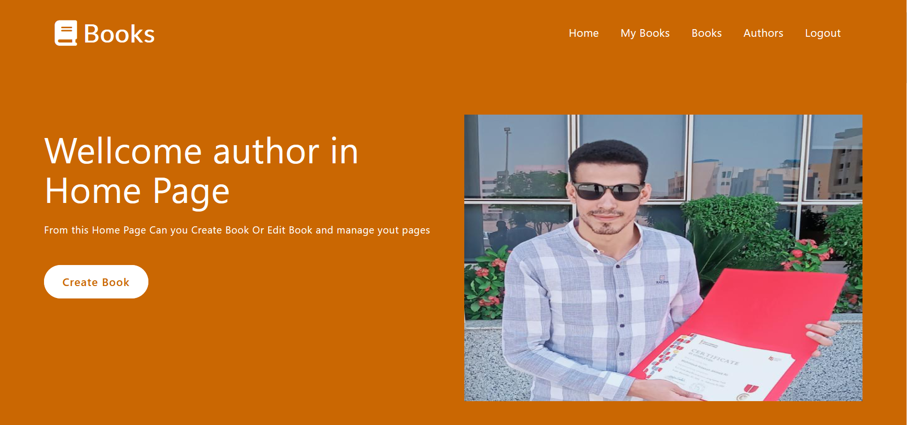
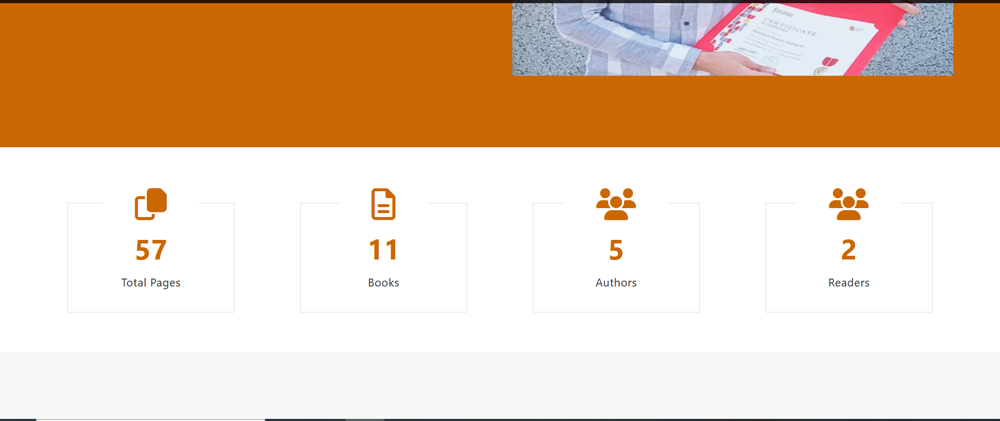
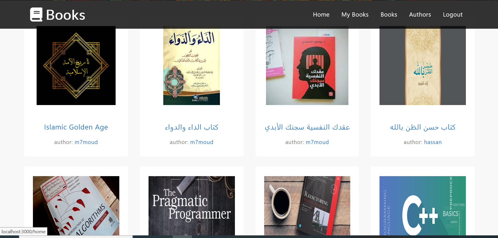
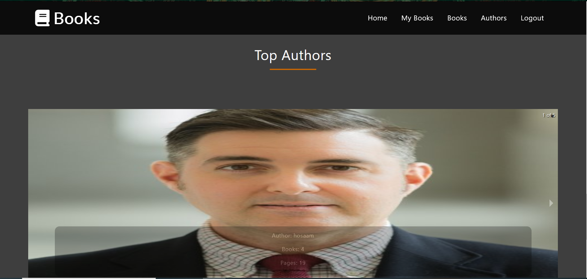

# Getting Started with  Author Book app

[](https://www.youtube.com/watch?v=Sr8g3lMEy4E)
<br/>
<br/>

<br>
<br>

<br>
<br>

<br>
<br>


# Book Author Front

Welcome to My Django api Project! This is a brief guide on how to set up and run the project locally.

## Prerequisites

Before getting started, make sure you have the following software installed on your machine:

-python (version 3.6 or higher)

## Installation

1. Clone the repository to your local machine:

   ```bash
   git clone https://github.com/M7moud-Hassan/book_author_api.git

2. run the follow command:

   ```bash
   pip install -r requirements.txt
   
3. run the follow command:

   ```bash
   python manage.py runserver
   
## if you delete database or you want to use new database follow these commands:

1. makemigrations:

   ```bash
   python manage.py makemigrations

2. migrate
     ```bash
     python manage.py migrate
3. add permissions
     ```bash
     python manage.py create_permissions

